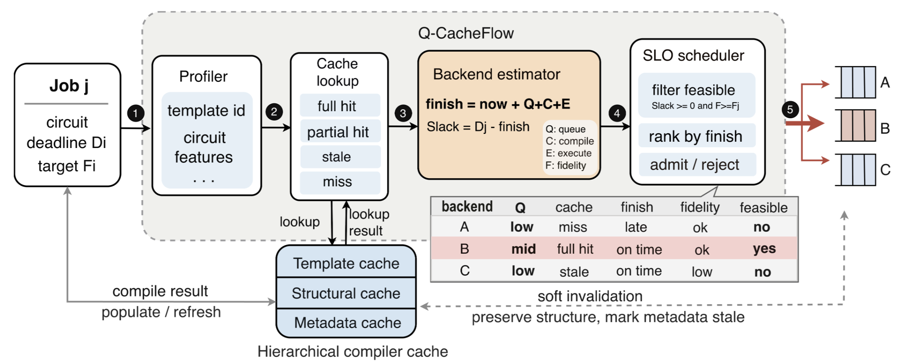
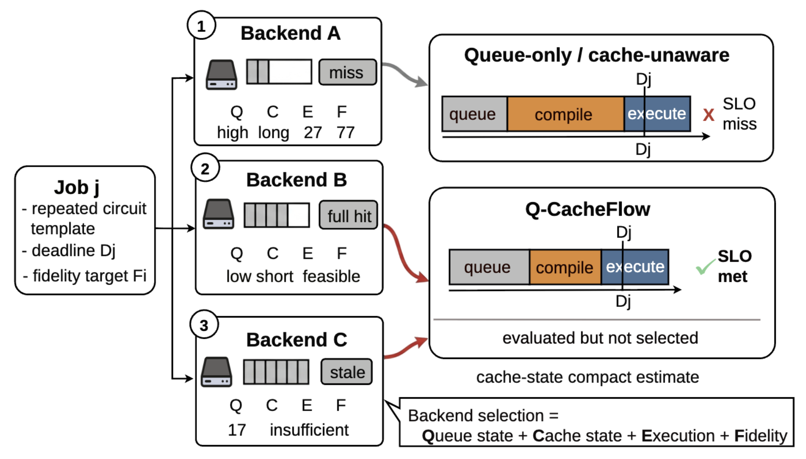
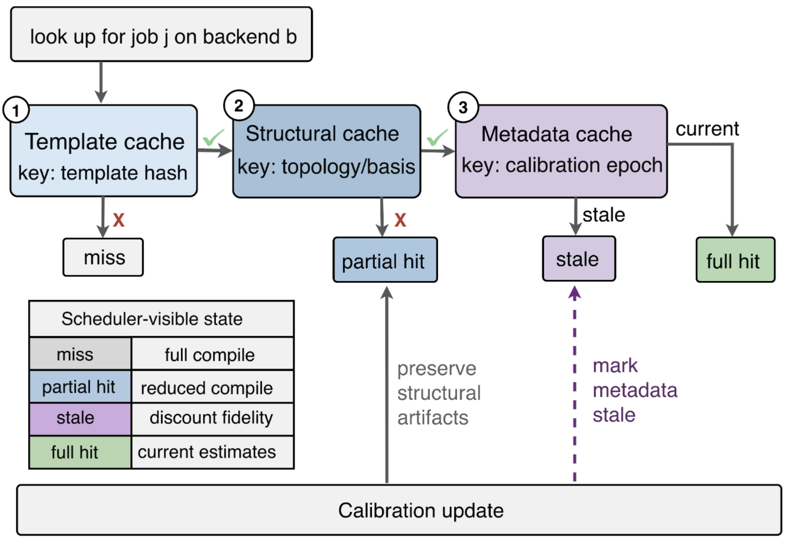

<h1 align="center">Q-CacheFlow</h1>

<p align="center">
  <b>Compiler-Cache-Aware Scheduling for Quantum Cloud Workloads</b>
</p>

<p align="center">
  
  
  
</p>

Q-CacheFlow is a lightweight Python implementation of a compiler-cache-aware
scheduler for quantum cloud workloads. It exposes backend-specific compiler
cache state as a first-class scheduling signal, then uses that signal to select
candidate backends under deadline and fidelity SLOs.

This repository contains the **core system code**: cache model, compiler
service, estimators, scheduling policies, workload generator, and event-driven
simulator. Large paper-only experiment suites, generated figures, logs, and
archived ablation scripts are intentionally omitted so that the public GitHub
repository stays focused and reusable.

## System Overview

<p align="center">
  
</p>

The scheduling path is intentionally explicit:

1. Profile the submitted circuit and derive a template hash.
2. Query backend-specific compiler-cache state for each candidate backend.
3. Estimate queue delay, compile time, execution time, finish time, and fidelity.
4. Filter candidates predicted to meet both deadline and fidelity SLOs.
5. Select the feasible backend with the earliest predicted finish time.
6. Apply calibration-aware cache updates after backend calibration changes.

## Motivation

Quantum-cloud schedulers usually rank devices by visible queue length, backend
quality, or estimated execution time. That is not enough for repeated NISQ
workloads: compilation is backend-specific, calibration-sensitive, and often
reusable across related circuits. A backend with a longer queue can still finish
earlier if it has a current compiled artifact, while a stale metadata hit can
look attractive but violate a fidelity target after calibration drift.

Q-CacheFlow treats compiler-cache state as part of the scheduling state. For
each arriving job, it evaluates candidate backends using queue delay, predicted
compile time, execution time, and fidelity feasibility together.

<p align="center">
  
</p>

## Highlights

- **Three-level compiler cache.** Q-CacheFlow separates reusable circuit
  templates, backend-structural compilation artifacts, and calibration metadata.
- **Scheduler-visible cache states.** A lookup reports `full_hit`,
  `partial_hit`, `metadata_stale`, or `miss` instead of collapsing reuse into a
  binary hit/miss signal.
- **SLO-aware backend selection.** The scheduler estimates queue delay,
  compile time, execution time, finish time, and fidelity for every candidate
  backend before selecting or rejecting a job.
- **Calibration-aware invalidation.** Soft invalidation preserves structural
  reuse while preventing stale fidelity metadata from being treated as current.
- **Reproducible simulator.** The event-driven simulator replays identical
  arrivals, backend states, cache warmup, and calibration updates across
  scheduling policies.

<p align="center">
  
</p>

## Cache State Semantics

| State | Meaning | Scheduler implication |
| --- | --- | --- |
| `full_hit` | Structural artifact and current calibration metadata are reusable. | Compile cost is close to lookup overhead; fidelity metadata is current. |
| `partial_hit` | Some reusable structure exists, but the backend still needs additional work. | Compile time is reduced, but not treated as free. |
| `metadata_stale` | Structural artifact exists, but metadata was produced under an older calibration epoch. | The scheduler should not trust old fidelity metadata as current. |
| `miss` | No useful reusable artifact is available for this job/backend pair. | The job pays the full backend-specific compile path. |

## Repository Layout

```text
Q-CacheFlow/
├── qcacheflow/
│   ├── cache/          # compiler-cache hierarchy and invalidation policies
│   ├── circuits/       # circuit generation, profiling, and template hashing
│   ├── compiler/       # Qiskit/fallback compile service and estimators
│   ├── core/           # job, backend, snapshot, and metric data structures
│   ├── pipeline/       # estimator + SLO-aware Q-CacheFlow decision path
│   ├── scheduler/      # Q-CacheFlow and baseline scheduling policies
│   └── simulator/      # event-driven execution and workload replay
├── examples/
│   └── quickstart.py   # minimal runnable comparison
├── assets/             # README architecture figures
└── requirements.txt
```

## Setup

```bash
git clone <your-repo-url> Q-CacheFlow
cd Q-CacheFlow
python3 -m venv .venv
source .venv/bin/activate
pip install -r requirements.txt
```

Qiskit is listed as the main dependency because it enables real transpilation
measurements. The core code also includes a simple fallback circuit path, so the
quickstart can still exercise scheduling logic in lightweight environments.

## Quick Start

Run the compact example:

```bash
python3 examples/quickstart.py
```

Expected output shape:

```text
policy              slo       p95     hit     dmr     fvr
---------------------------------------------------------
cache-unaware     0.xxx     x.xxx   0.xxx   0.xxx   0.xxx
qcacheflow        0.xxx     x.xxx   0.xxx   0.xxx   0.xxx
```

The columns report SLO goodput, p95 turnaround time, cache-hit rate, deadline
miss ratio, and fidelity violation ratio. Exact values can differ across Python
and Qiskit versions because transpilation time and generated circuits may vary.

## Common Knobs

| Knob | Location | Description |
| --- | --- | --- |
| `cache_policy` | `EventDrivenSimulator` | `none`, `whole-circuit`, or `pass-level` compiler-cache behavior. |
| `invalidation_policy` | `EventDrivenSimulator` | `full`, `none`, or `soft` handling after calibration updates. |
| `calibration_interval` | `EventDrivenSimulator` | Simulated interval between backend calibration changes. |
| `repetition_ratio` | `generate_workload` | Fraction of jobs drawn from reusable circuit templates. |
| `arrival_rate` | `generate_workload` | Offered load for the generated job stream. |
| `num_backends` | `make_backends` | Number of heterogeneous backend models to create. |
| `seed` | workload/backend/simulator constructors | Controls reproducible workload, backend, and calibration traces. |

## Minimal API Example

```python
from qcacheflow.core.backend import make_backends
from qcacheflow.core.metrics import summarize_results
from qcacheflow.scheduler.qcacheflow import QCacheFlowScheduler
from qcacheflow.simulator.event_driven import EventDrivenSimulator
from qcacheflow.simulator.workload import generate_workload

jobs = generate_workload(
    num_jobs=100,
    repetition_ratio=0.7,
    arrival_rate=2.0,
    seed=11,
)
backends = make_backends(num_backends=4, seed=112)

sim = EventDrivenSimulator(
    backends,
    QCacheFlowScheduler(),
    cache_policy="pass-level",
    invalidation_policy="soft",
    calibration_interval=8.0,
    seed=11,
)

results = sim.run(jobs)
print(summarize_results(results))
```

## Included Policies

| Policy           | Purpose                                                           |
| ---------------- | ----------------------------------------------------------------- |
| `qcacheflow`     | Deadline/fidelity SLO-aware scheduler using compiler-cache state. |
| `cache_unaware`  | Latency-oriented baseline that does not expose cache state.       |
| `least_busy`     | Selects the backend with the shortest visible queue delay.        |
| `latency_first`  | Ranks candidates by predicted latency.                            |
| `fidelity_first` | Prioritizes predicted backend fidelity.                           |
| `fifo`           | Simple first-come scheduling baseline.                            |
